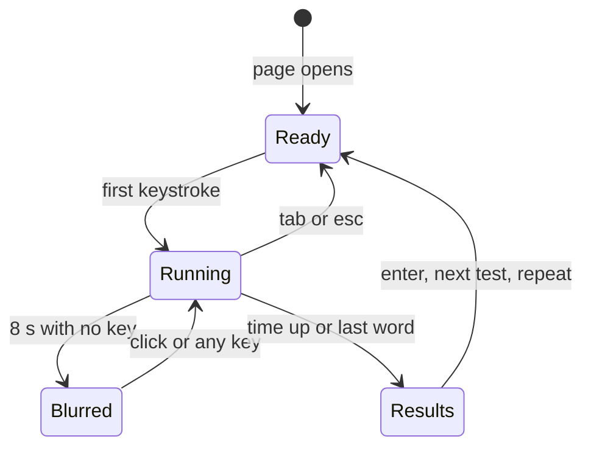
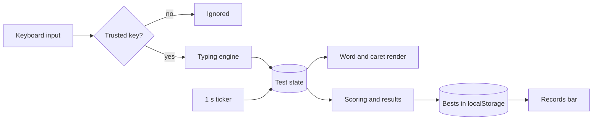

# FunType — Project Proposal

2026-09-23 · Kaon

## 1. Executive summary

FunType is a typing-speed trainer that runs entirely in one 45 KB HTML file, with no server, build step, install or account. A working build already exists; this proposal asks for approval to publish it and to build four follow-on phases in a fixed order.

The product competes on three things: honest measurement, an instant start, and a calm screen to practise in for twenty minutes. Each is a refusal rather than a feature: no login, no leaderboard, no telemetry. That makes them cheap to keep and hard for larger trainers to copy.

### Project at a glance

| Item | Detail |
| --- | --- |
| Project name | FunType |
| Type | Browser-based typing-speed trainer |
| Platform | Any current desktop browser; opens from `file://` or a web host |
| Deliverable | `index.html` (45,068 bytes) with markup, styles and logic in one file |
| Technology | HTML5, CSS custom properties, vanilla JavaScript, inline SVG |
| Data storage | Browser `localStorage`, key `funtype.v1`; nothing leaves the device |
| Repository | [github.com/KaonHew02/FunType](https://github.com/KaonHew02/FunType) |
| Status | Core build complete (first commit 11 Sep 2026); four roadmap phases proposed |
| Running cost | RM 0 / USD 0 — static files on free GitHub Pages hosting |
| Team | One developer |

### Decisions requested

1. **Publish it.** Switch on GitHub Pages so FunType has a real URL. The `.nojekyll` marker is already committed.
2. **Approve the measurement model in section 5.** Personal bests stop being comparable if the definitions change, so this must be fixed before real users hold records.
3. **Approve the roadmap in section 10.** Each phase spends some of the single-file simplicity, so the order should be chosen deliberately.

## 2. Background and problem statement

People who want to type faster have many places to practise but few that measure them honestly. Existing trainers fall into two groups, and both get the measurement wrong in different ways.

### Background

Typing speed is a daily productivity factor for developers, writers, students and support staff. The standard unit is words per minute (WPM), where one "word" is five characters. Improvement comes from short, regular drills with feedback the typist can trust.

### Problem statement

| Problem | Where it appears | Effect on the learner |
| --- | --- | --- |
| Gross WPM as the headline | Gamified, school-oriented trainers | Every keystroke counts, right or wrong, so the score rises as the typist gets sloppier |
| Corrections are penalised | Many trainers charge backspace as an error | Learners stop fixing mistakes to protect their score, which trains the wrong habit |
| Mandatory accounts and menus | Platform-style trainers | A login and several screens stand between the user and the first keystroke |
| Results stored on a remote server | Most online trainers | Typing history and habits leave the user's device |
| One "best" across all settings | Most trainers | Turning punctuation on lowers WPM, so the record reflects the easiest setting, not real skill |
| Scores are easy to fake | Browser-based trainers without guards | A console script or an edited save can post an impossible score |

### Proposed solution

FunType is a single-page trainer that measures the way a sceptic would and refuses everything else:

- **Honest numbers.** Net WPM is the headline, raw WPM sits beside it, and a consistency score exposes uneven pacing.
- **Instant start.** The words are on screen when the page opens; the first keystroke starts the test.
- **Records that mean something.** A personal best is stored per exact configuration, so settings never pollute each other.
- **Private by design.** Everything stays in the browser's own storage and is never sent anywhere.
- **Guarded scores.** Scripted typing, pasting, edited saves and on-screen edits are all rejected.

## 3. Objectives

The main objective is a typing trainer whose scores a sceptical typist would accept as fair, and which starts in under two seconds. The specific objectives below each have a target that can be checked.

| # | Objective | Target | Status |
| --- | --- | --- | --- |
| O1 | Measure typing with clearly defined, published formulas | Net WPM, raw WPM, accuracy, consistency and a four-way character breakdown on every result | Built |
| O2 | Start practice with no friction | First keystroke possible within 2 seconds of opening the page; no login or setup screen | Built |
| O3 | Offer drills for different skills | 4 modes (time, words, text, code) and 2 toggles (punctuation, numbers) | Built |
| O4 | Keep personal bests comparable | One record per exact configuration key, e.g. `time-30-p` | Built |
| O5 | Protect user privacy | Zero network calls apart from the font request; no analytics, accounts or backend | Built |
| O6 | Resist casual score tampering | Reject scripted keys, paste, runs over 400 WPM, edited saves and on-screen edits | Built (23 Sep 2026) |
| O7 | Run anywhere without installation | One HTML file that works from `file://`, a USB drive or a web host | Built |
| O8 | Make the tool pleasant for long sessions | 8 colour themes, reduced-motion support, clear focus states | Built |
| O9 | Publish the app at a public URL | Live on GitHub Pages | Proposed (Phase 0) |
| O10 | Turn measurement into coaching | Per-character error profile and targeted drills | Proposed (Phase 3) |

## 4. Scope and target users

FunType is a single-user, desktop, physical-keyboard trainer that keeps all data on the user's own browser. Anything that needs a server, an account or a classroom is out of scope.

### In scope

- Four drill modes with selectable length, plus punctuation and number toggles
- Live timer or word counter and live WPM during a test
- Results screen with headline figures, a pace chart and six detail facts
- Personal bests per configuration, all-time best and a test counter
- Eight colour themes, remembered between visits
- Local storage with a tamper seal and field validation
- Anti-cheat guards on input, results and saved data
- Brand identity: keycap logo, wordmark and a small-size favicon
- Publishing as a static site on GitHub Pages

### Out of scope

| Excluded | Reason |
| --- | --- |
| Accounts, login and cloud sync | Would need a backend and would move user data off the device |
| Global leaderboards and multiplayer races | Need a server that verifies each run; pull the product toward competition over practice |
| Mobile or touch-first layout | The product trains a physical keyboard; phones are not the target |
| Lessons, curriculum and teacher dashboards | A different product for classrooms |
| Advertising and analytics | Contradict the privacy position |

### Target users

| User group | Need | How FunType serves it |
| --- | --- | --- |
| **Primary:** people who type for work (developers, writers, support staff) | Twenty focused minutes and a number they can trust | Honest metrics; `code` mode drills JavaScript, Python and SQL symbols |
| **Secondary:** privacy-conscious learners and students | Practice without creating an account | No login; records never leave the browser |
| **Secondary:** casual users | A quick, pleasant speed check | Opens instantly; eight themes |
| **Not targeted:** schools managing classes | Cohorts, assignments, reports | Out of scope by design |

## 5. Features and functional requirements

The current build delivers four drill modes, a five-part measurement model, a results screen with a pace chart, and per-configuration personal bests. Everything in this section is implemented in `index.html` today.

### 5.1 Drill modes and content

| Mode | Lengths | Content source | What it trains |
| --- | --- | --- | --- |
| time | 15 / 30 / 60 / 120 s | Common-word list; 140 words at start, 60 more added when fewer than 30 remain | Sustained speed against a clock |
| words | 10 / 25 / 50 / 100 words | Common-word list | Finishing a fixed target |
| text | short / medium / long | 6 written passages (3 short, 2 medium, 1 long) about typing technique | Rhythm across real sentences |
| code | js / py / sql | 9 real code lines, 3 per language | Symbols, brackets and shift-key reach |

The word list holds 298 entries (288 unique, average 4.4 characters). It favours short, frequent words and ends with typing vocabulary such as *keyboard*, *rhythm* and *accuracy*. The same word never appears twice in a row.

### 5.2 Toggles

| Toggle | Effect | Frequency |
| --- | --- | --- |
| `! punctuation` | Capital after a sentence end; adds `, . ? ! ; :`, quotes, brackets and `'s` | About 27% of words get a mark |
| `# numbers` | Replaces a word with a number | About 11% of words; 40% of those are up to 4 digits |

Toggles apply to `time` and `words` modes. Both are part of the personal-best key because they change difficulty.

### 5.3 Keyboard controls

| Key | Action |
| --- | --- |
| `tab` | Restart with the same words |
| `esc` | New test with fresh words |
| `space` | Commit the current word (ignored on an empty word) |
| `backspace` | Delete one character; can step back into a previous word only if it was typed wrong |
| `ctrl` + `backspace` | Delete the whole current word |
| `enter` | On the results screen, start the next test |
| Click on the logo | Restart (the logo is a working button) |

### 5.4 Test flow



The clock starts on the first keystroke, not on page load. While running, the settings bar fades out and the live counter shows time left (or words done) and current WPM. The blur is a focus prompt only; the clock keeps running.

### 5.5 Results screen

- **Headline:** net WPM and accuracy, with a badge: `new best · +N`, `first record`, or `not recorded · over 400 wpm`.
- **Pace chart:** net and raw WPM per second, with an ✕ where errors landed. The y-axis snaps to a fixed ladder (20, 25, 40, 50 … 300) so runs compare by eye. Runs under 2 seconds show a "too short to chart" note.
- **Six facts:** test settings, raw WPM, consistency, characters (correct / wrong / extra / missed), time in seconds, personal best.
- **Two buttons:** *next test* (new words) and *repeat this text* (same words).

### 5.6 Personal bests and records

A best is stored per exact configuration. The key joins mode, length and toggles: `time-30`, `words-25-p`, `time-60-p-n`, `code-sql`. A new best needs a higher net WPM than the stored one; accuracy and date are kept alongside. The header shows three live chips: best for the current setting, all-time best, and tests run.

### 5.7 Measurement model

Net WPM counts only correct characters; a correctly typed word also earns its trailing space.

```math
\text{net WPM} = \frac{\text{correct characters} / 5}{\text{minutes elapsed}}
```

Raw WPM counts every character typed, right or wrong, over the same clock. It is shown beside net WPM so the gap is visible.

```math
\text{raw WPM} = \frac{\text{all characters typed} / 5}{\text{minutes elapsed}}
```

Accuracy counts keystrokes that hit the right character. Backspaces are free: they are neither keystrokes nor errors, so fixing a mistake is never punished.

```math
\text{accuracy} = \frac{\text{correct keystrokes}}{\text{correct keystrokes} + \text{wrong keystrokes}} \times 100
```

Consistency measures how even the per-second pace was. Each second, characters typed × 12 gives a WPM-equivalent sample; the result is clamped to 0–100.

```math
\text{consistency} = 100 \times \left(1 - \frac{\sigma}{\mu}\right)
```

| Character class | Meaning | What it tells the typist |
| --- | --- | --- |
| correct | Right character in the right place | — |
| wrong | Wrong character in a position | Finger accuracy |
| extra | Typed past the end of a word (capped at 12) | Not reading ahead |
| missed | Pressed space too early | Anticipating the word boundary |

Changing any formula later would silently break every stored best, because raw keystrokes are not kept. Any change must bump the storage key from `funtype.v1` to `funtype.v2`.

### 5.8 Functional requirements

| ID | Requirement | Status |
| --- | --- | --- |
| FR-01 | The user can choose one of four modes and one length per mode | Built |
| FR-02 | The user can switch punctuation and numbers on or off | Built |
| FR-03 | The test starts on the first keystroke with no start button | Built |
| FR-04 | Correct, wrong and extra characters are coloured as they are typed | Built |
| FR-05 | An animated caret follows the typing position; lines scroll after the second row | Built |
| FR-06 | Live time left (or word count) and live WPM show during a run | Built |
| FR-07 | The results screen shows the metrics, chart and facts in 5.5 | Built |
| FR-08 | A personal best is saved per configuration and flagged on the results | Built |
| FR-09 | Settings, theme, bests and test count persist between visits | Built |
| FR-10 | The user can pick one of eight themes from the footer | Built |
| FR-11 | `tab`, `esc`, `enter`, `ctrl` + `backspace` work as in 5.3 | Built |
| FR-12 | Scripted keys, paste and drag-and-drop cannot enter text | Built |
| FR-13 | Runs over 400 WPM are shown but never saved as a best | Built |
| FR-14 | Edited saves are detected and discarded | Built |
| FR-15 | On-screen edits to scores are reverted immediately | Built |

## 6. Non-functional requirements

The app must load in under 2 seconds, work without a network when opened as a file, and never send user data anywhere. The table sets a checkable target for each quality.

| ID | Quality | Requirement | How it is met |
| --- | --- | --- | --- |
| NFR-01 | Performance | Page ready to type within 2 s; no visible lag per keystroke | 45 KB file, no framework, only the current word is repainted per key |
| NFR-02 | Portability | Works from `file://`, a USB drive, email attachment or web host | Single self-contained file; favicon embedded as a `data:` URI |
| NFR-03 | Compatibility | Current Chrome, Edge, Firefox and Safari | Uses only settled features: `localStorage`, CSS custom properties, flexbox, grid, inline SVG |
| NFR-04 | Privacy | No personal data leaves the device | No backend, no analytics, no cookies; only request is Google Fonts |
| NFR-05 | Reliability | App still starts if storage is blocked or a save is corrupt | Every read and write in `try`/`catch`; bad fields fall back to defaults |
| NFR-06 | Resilience | Usable if the font server is unreachable | Fallback fonts: Segoe UI and Cascadia Mono / `ui-monospace` |
| NFR-07 | Accessibility | Keyboard-only operation; screen-reader labels; motion can be reduced | `aria-pressed` on toggles, labelled theme buttons and input, chart has an `aria-label`, `prefers-reduced-motion` respected, 2 px focus ring |
| NFR-08 | Usability | A first-time user can start without instructions | Words are on screen at load; key hints in the footer |
| NFR-09 | Responsiveness | Readable down to phone width | At 680 px or less the results stack and key hints hide; the typing area font scales with `clamp()` |
| NFR-10 | Input support | Works with IME and on-screen keyboards | A hidden input mirrors typed text when keys report as "Unidentified" |
| NFR-11 | Security | Stored data cannot inject markup | All stored values are validated and escaped before display |
| NFR-12 | Maintainability | Whole program readable in one sitting | About 900 lines, vanilla JavaScript, commented by section |
| NFR-13 | Cost | No running cost | Static hosting on free GitHub Pages |

## 7. System design and technology stack

FunType is a client-only application: one HTML file holds the markup, styles and about 680 lines of vanilla JavaScript, with the browser's `localStorage` as its only database. There is no server, build step or framework.

### 7.1 Technology stack

| Layer | Technology | Notes |
| --- | --- | --- |
| Structure | HTML5 | Semantic `header`, `main`, `section`, `footer` |
| Styling | CSS3 with custom properties | All colours are tokens, so a theme is a data change |
| Logic | Vanilla JavaScript (ES2020, strict mode) | One self-invoking function; no global variables leak |
| Charts | Inline SVG built at runtime | No charting library |
| Storage | Web Storage API (`localStorage`) | One key, `funtype.v1` |
| Anti-tamper | `MutationObserver`, `Event.isTrusted`, 53-bit string hash | See section 8 |
| Fonts | Google Fonts: Gabarito, JetBrains Mono | The only external request; preconnected |
| Version control | Git, hosted on GitHub | [KaonHew02/FunType](https://github.com/KaonHew02/FunType) |
| Hosting | GitHub Pages (static) | `.nojekyll` already committed |

### 7.2 Architecture



Keys pass the trust check, update the test state and repaint only the affected word. A one-second ticker samples the state for the live counter and chart. When the test ends, scoring writes the result and any new best to sealed storage.

### 7.3 Code modules inside `index.html`

| Module | Main functions | Responsibility |
| --- | --- | --- |
| Content | `WORDS`, `TEXTS`, `CODE`, `THEMES`, `AMOUNTS` | Word list, passages, code lines, theme palettes, mode lengths |
| State | `S`, `BESTS`, `TESTS` | Current test, records and counters |
| Storage | `load`, `save`, `sealOf` | Read, validate, seal and write the save |
| Theme | `applyTheme`, `buildThemes` | Set 11 CSS tokens; build the swatch row |
| Word generation | `plainWords`, `decorate`, `buildWords`, `extendWords` | Pick words; add punctuation and numbers |
| Rendering | `renderWords`, `paintWord`, `moveCaret`, `scrollLines` | Draw words, colour characters, move caret, scroll lines |
| Typing | `typeChar`, `commitWord`, `backspace` | Apply each key to the state |
| Clock and scoring | `startTest`, `tick`, `tally`, `consistency`, `finish` | Timing, samples and every metric |
| Results | `showResults`, `chartSVG`, `renderRecords`, `draw` | Results screen, chart, records bar, on-screen guard |
| Lifecycle and input | `newTest`, `focusTest`, key and input listeners | Restarts, focus, idle blur, keyboard handling |

### 7.4 Project files

| File | Size | Purpose |
| --- | --- | --- |
| `index.html` | 45,068 B | The application; the file to edit |
| `funtype.html` | 44,921 B | Same page without the outer HTML wrapper, published as a Claude Artifact |
| `logo.svg` | 776 B | Full logo: keycap mark and wordmark |
| `logo-mark.svg` | 530 B | Icon only, pure geometry |
| `logo-favicon.svg` | 515 B | Mark retuned for 16–24 px |
| `README.md` | 5,468 B | Modes, keys, formulas, tamper guards, design notes |
| `PROPOSAL.md` | ~38 KB | This proposal |
| `.nojekyll` | 0 B | Tells GitHub Pages to serve files as-is |

`funtype.html` is regenerated by stripping the first 5 and last 2 lines of `index.html`. The recipe depends on line counts, so nothing may be inserted above line 6.

```
sed '1,5d' index.html | sed '$d' | sed '$d' > funtype.html
```

### 7.5 Data design

All persistent data is one JSON object in `localStorage` under `funtype.v1`:

```
{
  "mode": "time",
  "amount": { "time": "30", "words": "25", "text": "medium", "code": "js" },
  "punctuation": false,
  "numbers": false,
  "theme": "dusk",
  "bests": { "time-30": { "wpm": 78, "acc": 96, "at": 1758499200000 } },
  "tests": 42,
  "seal": "3kq9zv1x0b2"
}
```

| Field | Type | Valid values |
| --- | --- | --- |
| `mode` | string | `time`, `words`, `text`, `code` |
| `amount` | object | One allowed length per mode (section 5.1) |
| `punctuation`, `numbers` | boolean | `true` / `false` |
| `theme` | string | One of the 8 theme names |
| `bests` | object | Key matches `mode-length[-p][-n]`; `wpm` integer 0–400, `acc` integer 0–100, `at` a timestamp |
| `tests` | integer | Positive safe integer |
| `seal` | string | Hash of all other fields (section 8) |

## 8. Score integrity and anti-tampering

Six guards, shipped on 23 Sep 2026, stop the common ways of faking a score: scripted typing, pasting, impossible speeds, edited or injected saves, and on-screen edits. They are deterrents, not locks, because the code runs in the user's own browser.

### 8.1 Threats and guards

| Threat | How someone would try it | Guard | Result |
| --- | --- | --- | --- |
| Auto-typer script | Dispatch fake key events from the console | Every key and input event must have `isTrusted = true` | Fake keys are ignored |
| Paste or drop | Paste the visible words into the hidden input | `paste` and `drop` events are cancelled | Nothing is entered |
| Impossible run | Any trick that yields an absurd speed | Runs over 400 WPM are labelled `not recorded` | Never becomes a personal best |
| Edited save | Change a number in DevTools → Local Storage | Save carries a `seal`; a mismatch discards the whole save | Records reset to empty |
| Injected values | Put markup or odd types into the save | Each field is checked against values the app itself can write; output is HTML-escaped | Bad values are dropped; no markup runs |
| On-screen edit | Change the WPM with Inspect Element | A `MutationObserver` restores the records bar and results screen | Edit is reverted at once |

### 8.2 How the seal works

1. On save, the app serialises every field except `seal` to JSON.
2. It prefixes the text with `funtype-seal:` and runs a 53-bit, two-lane multiplicative string hash.
3. The hash is stored in base 36 as `seal`.
4. On load, the hash is recomputed. Any difference means the save was edited, so it is replaced with a clean one.

Saves written before sealing existed are accepted once, then sealed, but only if every record is older than 23 Sep 2026, 01:00 UTC. A hand-made unsealed save with a recent record is rejected.

### 8.3 Why validation matters on GitHub Pages

On GitHub Pages, every repository under the same account shares one origin, and so one `localStorage`. Another project on that account could write to `funtype.v1`. Validating and escaping every stored value keeps such data from breaking the app or injecting markup.

### 8.4 Known limits

- The source is public, so a determined person can compute a valid seal or run a modified copy.
- Any such cheat only changes that person's own screen, because nothing is ever sent anywhere.
- A trusted, shared leaderboard would need a server that re-checks each run. That is out of scope.

## 9. UI/UX and visual identity

The interface is one calm screen where the words are the largest thing on it and everything else fades while you type. The brand is a keycap whose legend is a text caret, and it doubles as the restart button.

### 9.1 Screen layout

| Area | Contents | Behaviour |
| --- | --- | --- |
| Header | Logo and wordmark (left); three record chips (right) | Logo click restarts; chips update after each test |
| Command bar | Toggles · modes · lengths | Fades out while a test runs, returns on finish |
| Stage | Live counter, three visible lines of words, *restart test* button | Lines scroll so the current line stays second from the top |
| Results (replaces stage) | Headline, chart, six facts, two buttons | Shown when a test ends |
| Footer | Key hints, 8 theme swatches, tagline *"train the hands, the words follow."* | Key hints hide on narrow screens |

### 9.2 Interaction details

- **Caret:** a 3 px accent bar that glides between characters in 85 ms and blinks every 1.05 s while waiting.
- **Character colours:** untyped in `--sub`, correct in `--text`, wrong in `--error`, extra in `--error-extra`; a wrong word gets an underline once passed.
- **Focus:** after 8 s without a key, the words blur with the prompt "click here or press any key to focus".
- **Motion:** all animation and transitions switch off under the system's reduced-motion setting.

### 9.3 Typography

| Use | Typeface | Fallback | Why |
| --- | --- | --- | --- |
| Interface | Gabarito (400–800) | Segoe UI, system-ui | Warm geometric sans; keeps the chrome friendly |
| Everything typed, all numbers | JetBrains Mono (300–700) | Cascadia Mono, ui-monospace | Equal character widths so the caret moves evenly and error marks line up |

Numbers use tabular figures so digits do not shift as scores change.

### 9.4 Colour themes

Every colour is one of 11 CSS tokens, so a theme is a small data object. Each theme supplies its own `accent-ink` for text on the accent, so the logo recolours correctly in all eight.

| Theme | Type | Background | Accent |
| --- | --- | --- | --- |
| dusk (default) | Dark | `#16161e` | `#ff9e64` apricot |
| daylight | Light | `#eceef4` | `#cf6a2c` |
| matcha | Dark | `#1b2420` | `#9ccf5e` |
| cobalt | Dark | `#0f1729` | `#5ec8ff` |
| nordfall | Dark | `#2e3440` | `#88c0d0` |
| bubblegum | Light | `#fdf0f3` | `#e5527e` |
| mono | Dark | `#0e0e10` | `#f5f5f5` |
| terminal | Dark | `#050a05` | `#35ff4d` |

Chart colours stay fixed across themes so the legend always means the same thing: net `#d8792e`, raw `#6189e0`, errors `#cf4a66`. They were checked for colour-blind separation on dark and light surfaces.

### 9.5 Logo and brand mark

- **Concept:** a keycap whose legend is an I-beam text caret, the same caret the user chases while typing.
- **Construction:** a 48 × 48 grid; cap face in `--accent`, a skirt in `--accent-deep` 5 px below it, the caret in `--accent-ink`.
- **Motion:** the caret blinks on the same 1.05 s beat as the typing caret; the cap face sinks 2.6 px on hover or press.
- **Redesign (22 Sep 2026):** the first version put the caret in a dark inset "dish" and it filled only about 10% of the frame, blurring into a smudge at 38 px. The redraw removed the dish and grew the caret to 63% of cap height.
- **Small sizes:** `logo-favicon.svg` pushes the cap to the edges and thickens the caret; use it below about 28 px.
- **Wordmark:** Gabarito ExtraBold, tracking −0.022 em, "Fun" in accent and "Type" in text colour. In `logo.svg` it is live text and must be outlined before use where Gabarito is not installed.

## 10. Methodology, milestones and timeline

The project follows an iterative, incremental method: each phase is a small, shippable change that is built, checked in the browser and committed on its own. The core build is done; the five proposed phases below run from late September to mid-December 2026.

### 10.1 Method

1. **Define** the change and its effect on the measurement model and storage.
2. **Build** it in `index.html`, keeping the single-file rule unless a phase justifies breaking it.
3. **Check** it by hand in the browser: all modes, all eight themes, and the tamper guards.
4. **Regenerate** `funtype.html`, update `README.md`, and commit with a descriptive message.
5. **Publish** by pushing to GitHub; Pages serves the new version.

### 10.2 Completed milestones

| Date | Milestone | Commit |
| --- | --- | --- |
| 23 Sep 2026 | Score guards: trusted-key check, paste block, 400 WPM cap, sealed save, on-screen guard | `a14402c` |
| 22 Sep 2026 | Markdown project proposal added to the repository | `6465d3b` |
| 22 Sep 2026 | Logo redrawn so the caret survives small sizes; favicon added | `d812abf` |
| 11 Sep 2026 | First complete build: 4 modes, metrics, results chart, bests, 8 themes | `2432633` |

### 10.3 Proposed phases

| Phase | Work | Effort | Target date |
| --- | --- | --- | --- |
| 0 — Publish | Switch on GitHub Pages; share the URL | Under 1 hour | Sep 25, 2026 |
| Decision point | Settle the open questions on metrics (section 12) before real users hold records | 1 review | Sep 30, 2026 |
| 1 — Content depth | De-duplicate and grow the word list to about 1,000; add passages and TypeScript, Go and shell code | 1–2 sessions | Oct 9, 2026 |
| 2 — History and trend | Keep the last results per configuration; draw a trend line; migrate storage | 2–3 sessions | Oct 23, 2026 |
| 3 — Weakness analysis | Per-character error profile and drills weighted to weak keys | 5–8 sessions | Nov 27, 2026 |
| 4 — Shareable results (optional) | Encode a finished run in a URL fragment, no server | 1–2 sessions | Dec 11, 2026 |

A session means one focused working block of about 2–3 hours. Dates assume one developer working part-time.

## 11. Resources, budget and tools

The required budget is RM 0: every tool and service is free, and the only real cost is about 18–45 hours of one developer's time for phases 0–4.

### 11.1 People

| Role | Who | Responsibility |
| --- | --- | --- |
| Developer, designer and maintainer | Project owner (1 person) | Code, design, testing, documentation, publishing |
| AI coding assistant | Claude Code | Pair-programming, review and documentation; co-author on all four commits |
| Testers | Owner plus a few volunteer typists | Hands-on checks and feedback on fairness of scores |

### 11.2 Tools

| Tool | Use | Cost |
| --- | --- | --- |
| Windows 11 laptop with a physical keyboard | Development and testing | Existing |
| Git and GitHub | Version control and repository hosting | Free (public repository) |
| GitHub Pages | Static hosting | Free |
| Chrome, Edge, Firefox | Cross-browser testing and DevTools | Free |
| Google Fonts | Gabarito and JetBrains Mono | Free |
| Claude Code | AI-assisted development | Existing subscription |

### 11.3 Budget

| Item | Cost | Notes |
| --- | --- | --- |
| Hosting | RM 0 | GitHub Pages |
| Fonts and libraries | RM 0 | Open-licence fonts; no libraries used |
| Hardware | RM 0 | Existing laptop |
| Developer time | RM 0 (self-funded) | 9–15 sessions × 2–3 h ≈ 18–45 h |
| Custom domain (optional) | About USD 10–15 a year (approximate) | Only if a name other than `github.io` is wanted |
| **Total required** | **RM 0** |  |

## 12. Risks and mitigations

The biggest risk is changing the scoring formulas after users hold records, because old bests cannot be recalculated. Most other risks are small and already have a planned fix.

### 12.1 Risk register

| Risk | Likelihood | Impact | Mitigation |
| --- | --- | --- | --- |
| Scoring formulas change after launch | Low | High | Settle section 5.7 before publishing; any later change bumps the key to `funtype.v2` |
| Records exist on one browser only; clearing data loses them | High | Medium | Add export and import of the save file; accepted as the price of no backend |
| Content is small enough to memorise, inflating scores | High | Medium | Phase 1 grows the word list, passages and code |
| No automated tests on the scoring code | Medium | High | Add fixture tests: fixed keystroke sequences with known expected scores |
| Feature growth breaks the single-file rule | Medium | Medium | Make it an explicit decision at Phase 3 |
| `funtype.html` regeneration depends on line counts | Medium | Medium | Replace the `sed` recipe with a marker-based strip |
| Other repos on the same GitHub Pages origin write to storage | Low | Medium | Seal and field validation (done) |
| A determined user fakes a score | Medium | Low | Accepted: it only affects their own screen; no shared leaderboard |
| Google Fonts unreachable | Low | Low | Fallback fonts keep the app fully usable (done) |
| Single maintainer becomes unavailable | Medium | Medium | README, this proposal and readable single-file code allow hand-over |

### 12.2 Known issues in the current build

| Issue | Effect | Planned fix |
| --- | --- | --- |
| Word list has 10 duplicate entries (`door` ×3; `high`, `small`, `late`, `water`, `build`, `start`, `story`, `watch` ×2) | Slightly skews word frequency | De-duplicate in Phase 1 |
| Punctuation and numbers toggles still split the record key in `text` and `code` modes, though they do not change that content | `code-js` and `code-js-p` are separate records for identical text | Ignore toggles in the key for those modes, or hide the toggles there |
| `consistency()` starts with a filter that keeps every element | Dead code, no wrong result | Remove it |
| The "too short to chart" note says 15 seconds, but the chart appears after 2 | Minor wording mismatch | Align the message with the rule |
| No message on phones that a physical keyboard is expected | Confusing on touch-only devices | Add a short notice on small touch screens |

### 12.3 Open questions

1. Should consistency get headline space next to accuracy, since it is the most diagnostic number?
2. Should a personal best require a minimum accuracy, for example 90%, so a fast careless run cannot hold the record?
3. How large must the content pool be before memorisation stops mattering? About 1,000 words is an estimate, not a measured threshold.
4. Is the single-file rule worth keeping through Phase 3?

## 13. Testing and evaluation

Testing today is manual, using the 18 test cases below; the proposal adds automated fixture tests for the scoring code. Success is judged without analytics, against five measures a single maintainer can check honestly.

### 13.1 Manual test cases

| ID | Test | Expected result |
| --- | --- | --- |
| TC-01 | Type a 10-word test with no mistakes | Accuracy 100%; characters show `n/0/0/0` |
| TC-02 | Leave one wrong character uncorrected | Wrong = 1; word underlined; net WPM below raw WPM |
| TC-03 | Type a wrong character, then fix it with backspace | Wrong keystroke counts once; the backspace itself costs nothing |
| TC-04 | Press space two letters early | Missed = 2 |
| TC-05 | Type 15 characters past a word's end | Extra stops at 12 |
| TC-06 | Backspace at the start of a word after a correct word, then after a wrong word | Blocked after the correct word; allowed after the wrong one |
| TC-07 | Run `time 15` | Ends at 15 s; words never run out |
| TC-08 | Beat a stored best, then run a new configuration | `new best · +N`, then `first record` |
| TC-09 | Dispatch a `KeyboardEvent` from the console | Ignored |
| TC-10 | Paste or drop text into the test | Nothing entered |
| TC-11 | Edit a WPM in DevTools → Local Storage, then reload | Save discarded; records empty |
| TC-12 | Change the WPM with Inspect Element | Value snaps back |
| TC-13 | Open in a private window with storage blocked | App works; nothing remembered |
| TC-14 | Block `fonts.googleapis.com` | Fallback fonts; fully usable |
| TC-15 | Switch through all 8 themes | Text legible; logo recolours correctly |
| TC-16 | Open `index.html` straight from disk | Works exactly as on the web |
| TC-17 | Turn on reduced motion in the OS | No caret glide, blink or fades |
| TC-18 | Resize to 375 px wide | Results stack; key hints hide; no sideways scroll |

### 13.2 Cross-browser checks

Each release is checked in current Chrome, Edge and Firefox on Windows 11, and in Safari when a Mac is available.

### 13.3 Proposed automated tests

A small fixture file will replay fixed keystroke sequences through `typeChar`, `commitWord` and `backspace`. Each fixture asserts the exact net WPM, raw WPM, accuracy, consistency and character counts. This protects the part of the code users trust most.

### 13.4 Success measures

| Measure | Target | How it is judged |
| --- | --- | --- |
| Time to first keystroke | Under 2 s from opening the URL | Stopwatch test |
| Fair measurement | A sceptical typist reads section 5.7 and agrees the scores are fair | Feedback from 3–5 volunteer typists |
| Runs anywhere unchanged | Same behaviour from `file://`, USB drive and GitHub Pages | Direct check before each release |
| Themes hold up | All 8 legible with a correct logo | Visual pass; dusk, daylight, bubblegum and terminal checked so far |
| Real use | The owner practises with it by choice, not only to test it | Honest self-report after 4 weeks |

## 14. Future enhancements and conclusion

The most valuable future work is Phase 3, which turns FunType from a scoreboard into a coach by finding each user's weak keys. Everything before it protects the fairness of the numbers that coaching will rely on.

### 14.1 Future enhancements

| Enhancement | Value | Cost to simplicity |
| --- | --- | --- |
| Per-character weakness analysis and targeted drills (Phase 3) | High: the real differentiator | High: new state, panel and generator |
| History and trend line per configuration (Phase 2) | High: shows plateaus and progress | Medium: storage migration |
| Larger word list, more passages, TypeScript, Go and shell (Phase 1) | High: keeps scores honest | Low: data only; file grows to about 60 KB |
| Export and import of the save | Medium: protects records across devices | Low |
| "Hard words" toggle from a low-frequency list | Medium | Low |
| Minimum accuracy for a personal best | Medium: rewards clean typing | Low, but changes the model (decide before launch) |
| Shareable result links in the URL fragment (Phase 4) | Low to medium | Low, but risks a leaderboard feel |
| Offline install as a web app | Low to medium | Needs a service-worker file, breaking the one-file rule |

Accounts, cloud sync, multiplayer, a mobile layout, lessons and classroom tools remain out of scope (section 4).

### 14.2 Conclusion

FunType already works: four drill modes, a clear measurement model, per-configuration bests, eight themes, a finished brand and guards against score tampering, all in one 45 KB file that costs nothing to run. Its strength comes from what it refuses — accounts, servers and tracking — which keeps it private, fast and simple to maintain.

### 14.3 Recommendation

1. **Publish now (Phase 0).** Under an hour of work, and every later decision is easier with a live URL.
2. **Settle open questions 1 and 2 (section 12.3) before launch,** because both change the measurement model.
3. **Then build Phase 1** to protect score fairness, followed by Phases 2 and 3.
4. **Treat Phase 4 as optional** and revisit it after Phase 3 ships.
